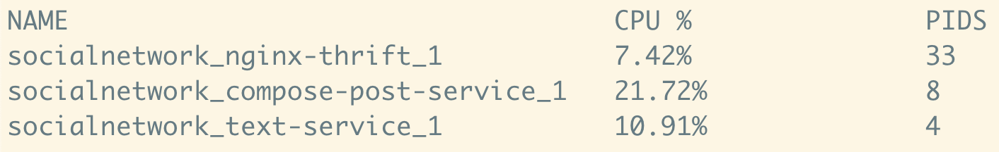
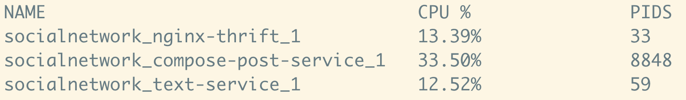

# Social Network (3 tiers)

## Structure

```
          +-------------------- Application -----------------------+
rload --> | nginx-thrift --> compose-post-service --> text-service |
          +--------------------------------------------------------+
```

Rload is a load generator that send HTTP requests to the application frontend. The services of the application comunicate with each other using Thrift API.

## Usage

Deploy the application and rload with docker-compose:

```bash
docker-compose up -d
```

You can modify https://github.com/richardlee159/thrift-backpressure-demo/blob/main/socialNetwork/docker-compose.yml#L35 to adjust the running time and throughput of rload. Use `-d` to specify the duration in seconds and `-r` the number of requests per seconds.

Moniter the CPU usage of each container:

```bash
docker stats --format "table {{.Name}}\t{{.CPUPerc}}\t{{.PIDs}}" socialnetwork_nginx-thrift_1 socialnetwork_compose-post-service_1 socialnetwork_text-service_1
```



In another shell, set a CPU limit for text-service:

```bash
docker update --cpus 0.13 socialnetwork_text-service_1
```

The limit should be slightly higher than its current CPU usage (in my case, 0.13).

Then you shall find the CPU usage increases for all the services in the calling chain:

